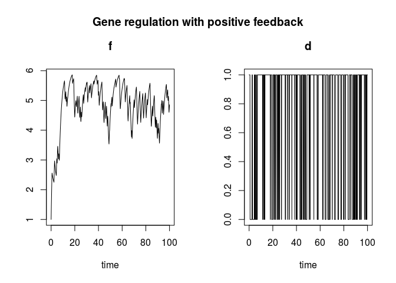
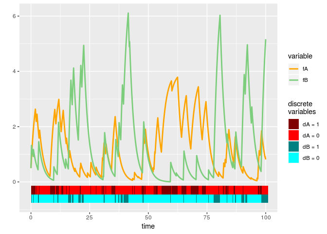

Package pdmpsim
================

-   [Introduction](#introduction)
-   [A simple example](#a-simple-example)
-   [Simulation](#simulation)
    -   [Multiple Simulations](#multiple-simulations)
-   [Plot methods](#plot-methods)
    -   [Plot single simulations](#plot-single-simulations)
    -   [Boxplot and violin plot](#boxplot-and-violin-plot)
    -   [Heatmap over all simulations](#heatmap-over-all-simulations)
    -   [Density plot and histogram](#density-plot-and-histogram)
    -   [Calculate and plot statistics](#calculate-and-plot-statistics)
-   [The generator](#the-generator)
-   [A more sophisticated example](#a-more-sophisticated-example)
-   [License](#license)

<!-- README.md is generated from README.Rmd. Please edit that file -->
Introduction
============

The goal of `pdmpsim` is to simulate [piecewise deterministic Markov processes](https://www.researchgate.net/publication/316281383_Piecewise-deterministic_Markov_processes_A_general_class_of_non-diffusion_stochastic_models_and_Discussion) (PDMPs) within R and to provide methods for analysing the simulation results.

It is possible to

-   simulate PDMPs
-   store multiple simulations in a convenient way
-   calculate some statistics on them
-   plot the results (there are different plot methods available)
-   compute the generator numerically

The PDMPs can have multiple discrete and continuous variables. They are not allowed to have boundaries or a varying number of continuous variables (the number should be independent of the state of the discrete variable).

You can install `pdmpsim` from GitHub with:

``` r
# install.packages("devtools")
devtools::install_github("CharlotteJana/pdmpsim")
```

A simple example
================

This is a simple example modelling gene expression with positive feedback:

``` r
examplePDMP <- new("pdmpModel",
                  descr = "Gene regulation with positive feedback",
                  parms = list(b = 0.5, a0 = 1, a1 = 3, k10 = 1, k01 = 0.5), 
                  init = c(f = 1, d = 1),
                  discStates = list(d = 0:1),
                  dynfunc = function(t, x, parms) {
                    df <- with(as.list(c(x, parms)), {
                      switch(d+1, a0 - b*f, a1 - b*f)
                    })
                    return(c(df, 0))
                  }, 
                  ratefunc = function(t, x, parms) {
                    return(with(as.list(c(x, parms)), switch(d + 1, k01*f, k10)))
                  }, 
                  jumpfunc = function(t, x, parms, jtype) {
                    c(x[1], 1 - x[2])
                  }, 
                  times = c(from = 0, to = 100, by = 0.1), 
                  solver = "lsodar")
```

The variable names and initial values are specified in slot **init**. In this case, the model has two variables, `f` and `d`. Slot **discStates** specifies that `d` is the discrete variable and can take the possible values 0 and 1. Constant parameters of the model are listed in slot **parms**, a short description is given in slot **descr** and is usually used as title for the plot methods. Slot **dynfunc** returns the ODEs of the variables, their value depends on the state of the discrete variable `d`. Slot **ratefunc** determines the rate and therefore probability that a jump occurs (there is only one type of jumps). Slot **jumpfunc** returns the new value after a jump.

Simulation
==========

A single simulation of a PDMP can be calculated with function `sim`. The function takes the model as argument and returns the same model, with the simulation results stored in a special slot named `out`.

``` r
out(examplePDMP) # no simulation
#> NULL
```

``` r
examplePDMP <- sim(examplePDMP)
head(out(examplePDMP)) # simulation stored in slot out
#>      time        f d
#> [1,]  0.0 1.000000 1
#> [2,]  0.1 1.243854 1
#> [3,]  0.2 1.475811 1
#> [4,]  0.3 1.696458 1
#> [5,]  0.4 1.906344 1
#> [6,]  0.5 2.105994 1
```

``` r
plot(examplePDMP) # plot the simulation results
```



Multiple Simulations
--------------------

Package `pdmpsim` provides two similar methods to perform and store a large number of different simulations of one PDMP.

Function `multSim` returns an S3-object of class `multSim` which contains a list of simulation results, a list of time values storing the time needed for the corresponding simulation, the model that was used for the simulations and a vector of numeric numbers. This vector is named `seeds`, its elements are used as argument to function `sim` and control the stochastic part of the model, making the simulation results reproducible. The vector `seeds` and the PDMP model are the only arguments needed for function `multSim`.

``` r
simulations <- multSim(examplePDMP, seeds = 1:300) # 300 simulations, they may take some time
```

The second function available to store multiple simulations is called `multSimCsv`. It is only useful if the memory used by all simulations exceeds the working memory. In this case, it is not possible to store all simulations in one object. They are stored in multiple csv files instead.

Plot methods
============

There are several functions available to plot the simulations of a PDMP. Most of them are generated with package `ggplot2` and can be modified afterwards.

Plot single simulations
-----------------------

The trajectory of a single simulation can be plotted with function `plot`, if the simulation is stored in slot `out` of the model. The generated plot is a base plot, but a plot generated by `ggplot2` is also possible, depending on the Boolean argument `ggplot`.

For objects of class `multSim`, which contain multiple simulations, another function is necessary. It is called `plotSeeds` and can plot up to four different trajectories at a time.

``` r
plotSeeds(simulations, seeds = c(1, 5))
```


Boxplot and violin plot
-----------------------

Function `plotTimes` allows to plot a box plot or violin plot for different time values over all simulations. Argument `plottype` determines the type of the plot.

``` r
plotTimes(simulations, plottype = "violin", times = c(3, 50, 100))
```


A special argument to function `plotTimes` is called `nolo` which stands for *number of labelled outliers*. This allows to label the most extreme outliers with the seed number which was used to create the simulation. If for example `nolo = 3`, a maximum of three outliers will be labelled for every time value.

``` r
plotTimes(simulations, vars = "f", times = c(20, 50, 80, 100), nolo = 3)
```


Heatmap over all simulations
----------------------------

If `plot` is called on an object of class `multSim`, it creates a heat map for every continuous variable and a (possibly smoothed) line plot for the discrete values of every discrete variable. This is the only plot method which gives an overview over all simulated data at every time value.

``` r
plot(simulations, discPlot = "line")
```


Density plot and histogram
--------------------------

Function `hist` plots a histogram over all simulations for a given time value. Function `density` creates a density plot, allowing multiple time values as input.

``` r
density(simulations, t = c(3, 50, 80, 100))
```


Calculate and plot statistics
-----------------------------

Use function `summarise_at` to apply functions as `mean`, `sd`, etc. on the simulated values. Function `plotStats` calls `summarise_at` internally and plots the results.

``` r
plotStats(simulations, vars = "f", funs = c("min", "mean", "median", "max"))
```


The generator
=============

Package `pmdpsim` provides the function `generator` to numerically calculate the generator of a PDMP without boundaries.

``` r
Q <- generator(examplePDMP)
```

Because the generator operates on functions, it hast to be applied to a function and afterwards to specific values.

``` r
f <- function(d, f) d*f^2
Q(f)(t = 10, x = c("d" = 1, "f" = 4))
#> [1] -11
```

See `?generator` for correct usage.

A more sophisticated example
============================

The PDMP presented in this paragraph models a gene regulation mechanism with toggle switch between two genes. It is included in package `pdmpsim` as an example, a detailed description of the different slots can be loaded with `?toggleSwitch`.

We consider two genes *A* and *B*, and the concentration of their gene products, *f*<sub>*A*</sub> and *f*<sub>*B*</sub>. A product of gene *A* can block the transcription of gene *B* and therefore affects the concentration *f*<sub>*B*</sub>. Conversely, a product of gene *B* can block gene *A*. See the left part of the picture below.


The PDMP contains six different constant parameters: *k*₀₁, *k*₁₀, *a*<sub>*A*</sub>, *a*<sub>*B*</sub>, *b*<sub>*A*</sub> and *b*<sub>*B*</sub>. It has two discrete variables *d*<sub>*A*</sub> and *d*<sub>*B*</sub>, where *d*<sub>*A*</sub> represents the status of gene *A* (inactive/active) and *d*<sub>*B*</sub> represents the status of gene *B*. There are two different type of jumps, the first describes a change in gene *B*, the second a change in gene *A*. The ODEs for *f*<sub>*A*</sub> and *f*<sub>*B*</sub> depend on the values of the discrete variables, as can be seen in the right part of the figure above.

The formulation as `pdmpModel` object is as follows:

``` r

toggleSwitch <- pdmpModel(
    descr = "Toggle switch with two promotors",
    parms = list(bA = 0.5, bB = 0.5, aA = 2, aB = 4, k01 = 0.5, k10 = 2),
    init = c(fA = 0.5, fB = 0.5, dA = 1.0, dB = 1.0),
    discStates = list(dA = c(0, 1), dB = c(0, 1)),
    times = c(from = 0, to = 100, by = 0.01),
    dynfunc = function(t, x, parms) {
       df <- with(as.list(c(x, parms)), c(-bA*fA + aA*dA, -bB*fB + aB*dB))
       return(c(df, 0, 0))
    },
    ratefunc = function(t, x, parms) {
       return(with(as.list(c(x, parms)), c(switch(dB+1, k01, k10*fA),
                                           switch(dA+1, k01, k10*fB))))
    },
    jumpfunc = function(t, x, parms, jtype){
       return(with(as.list(c(x, parms)), c(fA, fB, switch(jtype,
                                                          c(dA, 1-dB),
                                                          c(1-dA, dB)))))
    })
```

``` r
plot(sim(toggleSwitch), ggplot = TRUE) + 
  ggplot2::scale_color_manual(values = c("orange", "palegreen3")) # change color
```



License
=======

Some classes introduced in package `pdmpsim` are based on code from package [simecol](http://simecol.r-forge.r-project.org/). Both packages are free open source software licensed under the [GNU Public License](https://www.gnu.org/licenses/#GPL) (GPL 2.0 or above). The software is provided as is and comes WITHOUT WARRANTY.
